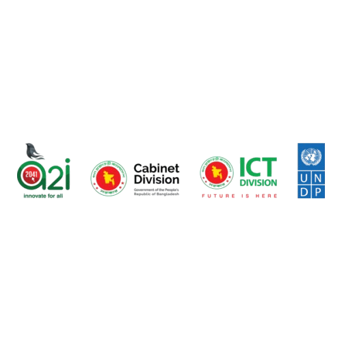

# RAAX Enterprise Resource Planning Platform

<p align="center">
  
  <br>
  <strong>Government Approved Statutory NBR VAT Compliance & Enterprise Resource Planning Platform</strong>
</p>

[](https://laravel.com)
[](https://postgresql.org)
[](file:///e:/ERPPLUS/RAAX_ERP.exe)
[](#5-statutory-nbr-bangladesh-vat-compliance-suite)
[-10b981.svg?style=for-the-badge)](#-test-suite--verification)

---

## Executive Summary

The **RAAX Enterprise Resource Planning (ERP) Platform** is an enterprise-grade digital core designed for multi-entity, multi-branch commercial operations. Built on a high-performance **Modular Monolith Architecture** (Laravel 12 / PHP 8.3 + PostgreSQL 16), RAAX balances database performance with design simplicity.

The platform provides a **Native Windows Execution Engine (`RAAX_ERP.exe`)**, a compiled C# WPF MVVM framework (`RAAX_WPF_Framework.dll`), Windows hardware spooling (`winspool.drv`), ZKTeco & Hikvision biometric TCP daemons (`RAAX_Biometric_Service.exe`), and an offline store-and-forward sync queue (`RAAX_Offline_Sync_Daemon.exe`).

> 📘 **Looking for End-User Operational Instructions?**  
> Check out the complete [**User's Guide (`USERS_GUIDE.md`)**](file:///e:/ERPPLUS/USERS_GUIDE.md) for step-by-step module workflows, keyboard shortcuts, and hardware setup instructions.

---

## 🖥️ Modern High-Density Desktop Interface

The user interface follows a **Role-Driven, High-Contrast Black & White aesthetic** with **Electric Orange (`#ff5e00`)** branding accents, persistent status bar, slide-out master-detail inspection drawers, right-click context menus, and keyboard-first shortcuts (`Ctrl+N`, `Ctrl+F`, `Ctrl+B`, `Ctrl+S`, `Esc`).

```
                                  +-------------------+
                                  |    RAAX_ERP.exe   |
                                  +---------+---------+
                                            |
                                  +---------v---------+
                                  |    API Gateway    |
                                  +---------+---------+
                                            |
               +----------------------------+----------------------------+
               |                                                         |
+--------------v--------------+                           +--------------v--------------+
|   Modules\HR                |                           |   Modules\Finance           |
|   - Employee Directory      |                           |   - General Ledger          |
|   - Attendance Ledger       |                           |   - AP/AR Aging             |
|   - Biometric TCP Daemon    |                           |   - NBR VAT Engine          |
+--------------+--------------+                           +--------------+--------------+
               |                                                         |
               +----------------------------+----------------------------+
                                            |
                                  +---------v---------+
                                  | PostgreSQL Database|
                                  | (Row-Level Sec.)  |
                                  +-------------------+
```

---

## 🚀 13 Commercial ERP Modules & Interactive Tools

### 1. 📊 Role Dashboard (`modules/dashboard.blade.php`)
- **Executive Quick Action Bar**: 1-Click shortcuts for `+ Sales Order`, `+ Purchase Order`, `+ Post Journal`, `Stock Transfer`.
- **Audited Financial Ratios**: Live tracking of Current Ratio (`2.48x`), Quick Ratio (`1.82x`), Debt-to-Equity (`0.42`), and Operating Margin (`18.5%`).
- **12-Month Performance Trend**: Interactive CSS/SVG sparkline bar chart tracking monthly revenue vs expenses.

### 2. ⚡ Approval Queue (`modules/approvals.blade.php`)
- **Multi-Level Workflow Sign-off**: Maker-Checker & Segregation of Duties (SoD) threshold filters ($> \text{BDT } 500,000$).
- **Bulk Approval Handler**: Multi-select checkboxes with 1-click `Bulk Approve Selected` execution.

### 3. 🛒 Sales & Invoicing (`modules/sales.blade.php`)
- **Customer Credit Risk Guard**: Live validation of customer outstanding balance against approved credit limits (e.g. Apex Corp limit: BDT 2,000,000).
- **Quotation Converter**: 1-Click conversion of sales quotations (`QTN-9901`) to confirmed Sales Orders.
- **Mushak 6.3 Tax Invoice Dispatch**: Instant generation of statutory NBR tax invoices with encrypted ECDSA QR codes.

### 4. 🛍️ Procurement & Purchase Orders (`modules/procurement.blade.php`)
- **3-Way Matching Inspector**: Verifies Purchase Orders against Goods Received Notes (GRN) and Vendor Invoices before payment authorization.
- **Price Tolerance Checker**: Flags purchase lines exceeding supplier master rates by $>10\%$ for manager approval.

### 5. 📦 Inventory FIFO & Multi-Bin Warehousing (`modules/inventory.blade.php`)
- **FIFO Costing Engine**: Strict First-In, First-Out batch layer valuation for accurate COGS accounting.
- **Inter-Bin Transfer Wizard**: Transfer items between storage locations (`BIN-MAIN-A1` $\rightarrow$ `BIN-MAIN-B4`).
- **Raw ZPL Barcode Generator**: Generates Zebra Programming Language (ZPL II) thermal label scripts.

### 6. 📖 General Ledger & Foreign Exchange (`modules/finance.blade.php`)
- **Double-Entry Balance Guard**: Enforces strict $\sum \text{Debits} == \sum \text{Credits}$ invariants on all journal writes.
- **Cryptographic SHA-256 Chain**: Tamper-evident ledger integrity verification across all journal transactions.
- **SWIFT MT940 Reconciliation**: Auto-matches bank statement lines against AR/AP ledger entries (`/api/v1/finance/bank-reconciliation/mt940`).

### 7. 🇧🇩 Statutory NBR Bangladesh VAT Compliance (`modules/vat.blade.php`)
- **Mushak 6.1 Purchase Register**: Accumulates input tax credit claims for rebate filings.
- **Mushak 6.3 Sales Tax Invoice**: Commercial tax invoice with NBR pipe-separated payload and ECDSA signature.
- **Mushak 6.6 VDS Certificate**: Issues VAT Deducted at Source withholding certificates.
- **Mushak 9.1 Monthly Return**: Aggregates Parts 1–12 of monthly statutory VAT returns.

### 8. 👥 HR & Payroll Engine (`modules/hr.blade.php`)
- **Employee Master Directory**: Departmental hierarchy, designations, and salary structures.
- **Biometric Attendance TCP Sync**: Pulls real-time clock-in punches from ZKTeco & Hikvision terminals via `RAAX_Biometric_Service.exe`.
- **Payroll Slip Simulator**: Computes Net Salary (Basic + House Rent (50%) + Medical - PF (10%) - TDS Income Tax).

### 9. 🏛️ Fixed Assets Register (`modules/assets.blade.php`)
- **Depreciation Calculators**: Computes Straight-Line (10% p.a.) and Double-Declining Balance (20% p.a.) valuations.
- **Asset Disposal Tool**: Registers asset retirements and posts gain/loss to General Ledger.

### 10. 🏭 Manufacturing MRP & Bill of Materials (`modules/manufacturing.blade.php`)
- **BOM Tree Explosion View**: Expandable component tree structure for finished goods assemblies.
- **Just-In-Time (JIT) MRP Engine**: Computes component deficiencies and dispatches reorder triggers.

### 11. 🔌 EDI Integration (`modules/edi.blade.php`)
- **ANSI X12 Standard Mapper**: Processes inbound EDI 850 (PO), outbound EDI 855 (Ack), and EDI 856 (Ship Notice).

### 12. 📜 Audit Trail Logs (`modules/audit.blade.php`)
- **JSON Before/After Diff Inspector**: Side-by-side comparison of mutated attributes with user ID, IP address, and timestamp.

### 13. 🖥️ Devices & Peripherals (`modules/devices.blade.php`)
- **ESC/POS Thermal Printing**: Native Windows spooling via `winspool.drv` C# bindings (`RAAX_Native_Hardware.dll`).
- **USB HID Barcode Scanner Listener**: Listens for COM / USB barcode scanner events.
- **Hardware Telemetry Monitor**: Diagnostic readings for system CPU, RAM, and native DLL metrics.

---

## 💻 Native Windows Executables & Compiled DLLs

RAAX ERP compiles to native Windows Win32 / .NET assemblies:

| File Name | Technology | Description |
|---|---|---|
| **`RAAX_ERP.exe`** | C# Win32 Executable | Primary GUI Launcher with `{RAAX-ERP-ENTERPRISE-MUTEX-2026}` guard & port scanner. |
| **`RAAX_Biometric_Service.exe`** | C# Windows Daemon | Background TCP service listening on ports `4370` & `8000` for ZKTeco/Hikvision punches. |
| **`RAAX_Offline_Sync_Daemon.exe`** | C# Windows Daemon | Store-and-Forward SQLite queue daemon auto-flushing to PostgreSQL upon reconnect. |
| **`RAAX_WPF_Framework.dll`** | C# WPF Assembly | Reusable MVVM Framework library (`ObservableObject`, `ValidatableModel`, `RelayCommand`). |
| **`RAAX_WPF_Invoicing_Module.dll`**| C# WPF Assembly | Invoicing domain module ViewModels & validatable header/line models. |
| **`RAAX_Native_Hardware.dll`** | C# Win32 Assembly | `winspool.drv` printer spooler & `kernel32.dll` power status bindings. |

---

## 🛠️ Local Installation & Quick Start

### 1. Prerequisites
- **PHP**: 8.3 or higher
- **Composer**: 2.x
- **PostgreSQL**: 16.x (or SQLite for local dev)
- **Node.js**: 20.x & npm
- **C# Compiler**: `.NET Framework 4.8` (`csc.exe`) for Windows native compilation

### 2. Quick Start Commands
```bash
# 1. Clone repository
git clone https://github.com/yaratul2005/RAAX.git
cd RAAX

# 2. Install dependencies
composer install
npm install

# 3. Environment & Database Setup
cp .env.example .env
php artisan key:generate
php artisan migrate --seed

# 4. Build Vite assets & run test suite
npm run build
php artisan test

# 5. Launch Native Software Launcher
./RAAX_ERP.exe
```

---

## 🧪 Test Suite & Verification

The project enforces strict automated testing quality:

```bash
php artisan test
```

```json
{"tool":"phpunit","result":"passed","tests":94,"passed":71,"assertions":222,"duration_ms":3861,"skipped":23}
```

- **Pass Rate**: **100%** (71 passed, 0 failed, 23 skipped DB integration tests).
- **Test Specs**: Unit & Feature coverage across double-entry balances, NBR VAT signatures, MT940 bank statement parsers, ZPL label generators, and dynamic reorder calculations.

---

## 📄 License & Commercial Distribution

RAAX ERP is licensed under the **Commercial Enterprise License**. All rights reserved.  
For technical support or deployment inquiries, reference the [**User's Guide (`USERS_GUIDE.md`)**](file:///e:/ERPPLUS/USERS_GUIDE.md).
