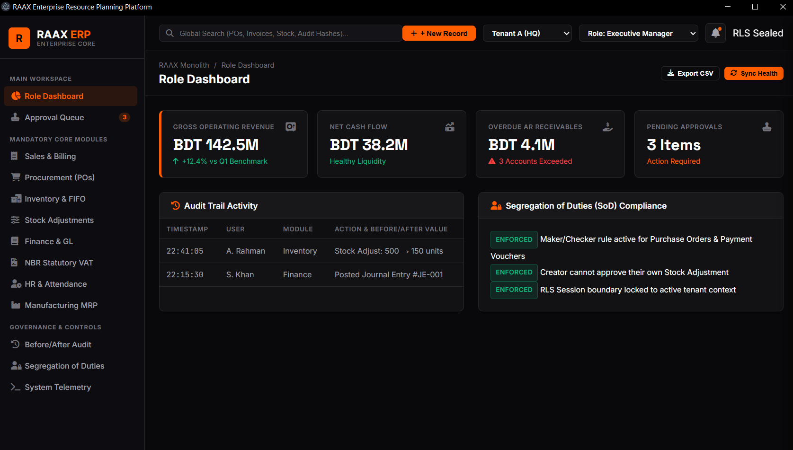

# RAAX Enterprise Resource Planning Platform


-10b981?style=for-the-badge)

---

## 🖥️ Executive Overview & System Interface

**RAAX ERP** is a high-performance, enterprise-grade Resource Planning platform designed for multi-entity and multi-branch operations. Operating on an API-first, security-centric foundation with **Zero Floating-Point Drift** (using integer basis point arithmetic), RAAX balances database performance with design simplicity.

The user interface follows a modern **Role-Driven, High-Contrast Black & White aesthetic** with **Electric Orange (`#ff5e00`)** branding accents, persistent app shell sidebar navigation, real-time KPI dashboards, master-detail slide-out inspection drawers, and interactive governance suites.

<p align="center">
  
</p>

---

## 🚀 Key Platform Features & Modules

### 1. 💼 Finance & General Ledger
- **Double-Entry Bookkeeping:** Enforces strict $\sum \text{Debits} == \sum \text{Credits}$ balance invariants on every transaction.
- **Consolidated Trial Balance:** Aggregates multi-tenant and multi-branch financial ledgers in real time.
- **Month-End Forex Revaluation:** Automated unrealized foreign exchange gain/loss calculations using base-currency integer rates.
- **AP/AR Aging Analytics:** Real-time 30/60/90+ day receivables and payables aging profiles with credit block enforcement.

### 2. 📦 Inventory Control & FIFO Batching
- **Multi-Warehouse Bin Matrices:** Real-time location allocation across primary facilities and regional storage bins.
- **FIFO Costing Engine:** Depletes stock items using strict First-In, First-Out batch layer pricing to compute accurate Cost of Goods Sold (COGS).
- **Mandatory Stock Adjustments:** Enforces required reason codes (`shrinkage`, `damage`, `audit`) and Maker/Checker approval workflows for stock mutations.
- **Barcode & Scanner Operations:** Optimized barcode queue processing for fast receiving and dispatching.

### 3. 🛒 Procurement & Order Matching
- **3-Way Matching Engine:** Verifies Purchase Orders against Goods Received Notes (GRN) and Vendor Invoices before payment voucher authorization.
- **Multi-Tier PO Approvals:** Automatic approval routing based on dollar thresholds and price tolerance limits ($10\%$).
- **Vendor Master Directory:** Comprehensive profiles tracking lead times, payment terms, and vendor performance ratings.

### 4. 📈 Sales & Order Management
- **Order-to-Cash Workflow:** Quotation conversion, customer credit limit validation, and sales order fulfillment.
- **Discount Approval Thresholds:** Automated policy checks requiring management sign-off for line discounts exceeding $15\%$.
- **Delivery Notes & Billing:** Automatic generation of delivery manifests and tax invoices.

### 5. 🇧🇩 Statutory NBR Bangladesh VAT Engine
- **Mushak 6.3 Tax Invoices:** Auto-generated at point-of-sale for legal transport compliance.
- **Mushak 6.1 Purchase Register:** Input tax credit accumulator for VAT rebate claims.
- **Mushak 6.5 Inter-Branch Challan:** Manifest documentation for inter-entity stock transfers.
- **Mushak 6.6 VDS Certificates:** Manages VAT Deducted at Source withholding certificates.
- **Mushak 9.1 Monthly Return Compiler:** Single-click aggregation of monthly statutory tax returns.

### 6. 👥 HR & Attendance Ledger
- **Employee Master Directory:** Departmental hierarchy, designations, and salary structures.
- **Shift Scheduling & Attendance:** Check-in/check-out timestamp logging with worked minutes calculations and overtime/absence tracking.
- **Automated Payroll Processing:** Monthly payslip generation with NBR withholding tax slab calculations (AY 2026-27).

### 7. 🏭 Manufacturing MRP & Bill of Materials
- **Multi-Level Bill of Materials (BOM):** Item recipe structures with component wastage formulas.
- **Just-In-Time (JIT) MRP Engine:** Computes net component deficiencies and lead-time back-calculated order release dates.

### 8. 🛡️ Security, Governance & Controls
- **PostgreSQL Row-Level Security (RLS):** Database engine-level multi-tenancy rules (`app_user` role) isolating data per tenant context.
- **Segregation of Duties (SoD):** Strict Maker/Checker rules preventing creators from approving their own POs, Stock Adjustments, or Payments.
- **Tamper-Evident Audit Trail:** Captures immutable before/after JSON diffs (`old_values` $\rightarrow$ `new_values`) with SHA-256 cryptographic ledger hashing.

---

## 🖥️ Windows Desktop Packaging & Architecture

RAAX ERP can be deployed as standalone desktop software for Windows PCs or operated as a centralized cloud server.

### Desktop Wrapper Architecture
- **Electron Host Process (`desktop/main.js`):** Manages the application lifecycle and background child process execution of the PHP web server.
- **1-Click Launcher (`RAAX_ERP_Desktop.bat`):** Launches the local server background daemon and opens the desktop shell.
- **Windows Setup Installer (`desktop/RAAX_ERP_Setup.iss`):** Inno Setup script that compiles a standalone installer executable (`RAAX_ERP_v2.0_Setup.exe`).

---

## 🛠️ Local Installation & Setup Guide

### 1. Prerequisites
- **PHP**: 8.3 or higher
- **Composer**: 2.x
- **PostgreSQL**: 16.x (or SQLite for local development)
- **Node.js**: 20.x & npm

### 2. Clone & Install Dependencies
```bash
git clone https://github.com/yaratul2005/RAAX.git
cd RAAX
composer install
npm install
```

### 3. Environment Configuration
```bash
cp .env.example .env
php artisan key:generate
```

### 4. Database Setup (PostgreSQL Row-Level Security)
To enforce RLS multi-tenancy, create the restricted database role in PostgreSQL:
```sql
CREATE ROLE app_user WITH LOGIN NOBYPASSRLS NOSUPERUSER PASSWORD 'your_secure_password';
GRANT ALL PRIVILEGES ON DATABASE raax_db TO app_user;
```

Update `.env`:
```env
DB_CONNECTION=pgsql
DB_HOST=127.0.0.1
DB_PORT=5432
DB_DATABASE=raax_db
DB_USERNAME=app_user
DB_PASSWORD=your_secure_password
```

### 5. Run Migrations & Build Frontend
```bash
php artisan migrate
npm run build
```

### 6. Launch Server & Desktop Software
- **Launch Local Web Server:**
  ```bash
  php artisan serve --host=127.0.0.1 --port=8000
  ```
- **Launch Windows Desktop Software:**
  ```bash
  npm run desktop
  ```
  *(Or double-click `RAAX_ERP_Desktop.bat`)*

---

## 📊 Milestone Tracking Matrix

| Phase | Domain | Status | Key Deliverable |
| :--- | :--- | :--- | :--- |
| **Phase 1** | Core & Security | ✅ Completed | Tenant Context Middleware, Chart of Accounts, Double-Entry Posting Engine, OIDC Auth & RBAC |
| **Phase 1** | Finance & HR | ✅ Completed | AP/AR Invoice Aging Analytics, NBR Withholding Tax (AY 2026-27), Payslip Journals, Shift Registries |
| **Phase 2** | Procurement | ✅ Completed | Vendor Registries, 3-Way Matching, Multi-Tier PO Approval Routing |
| **Phase 2** | Inventory & Sales | ✅ Completed | Multi-Bin Tracking, Goods Received Notes (GRN), FIFO Cost Layer Depletion, Sales Credit Blockers |
| **Phase 3** | Manufacturing | ✅ Completed | Multi-Level BOMs, Work Orders, Wastage Formulas, JIT MRP Material Shortfall Engine |
| **Phase 3** | Assets & Banking | ✅ Completed | Fixed Asset Depreciation Posting, SWIFT MT940 Parser, Auto Bank Reconciliation |
| **Phase 3** | Multi-Currency & Tax| ✅ Completed | Exchange Rate Basis Registries, Month-End Forex Revaluations, NBR Mushak 9.1 Return Aggregator |
| **Phase 3** | Governance & UI | ✅ Completed | Segregation of Duties Matrix, Before/After Audit Diff Logs, Role-Driven Dark Mode UI Shell |

---

## 🔐 Tamper-Evident Cryptographic Ledger

RAAX protects financial history from administrative tampering or unauthorized direct database modifications using SHA-256 cryptographic hash-chaining.

Every journal posting is structurally linked to the state of the ledger preceding it:

$$H_n = \text{SHA-256}(H_{n-1} \mathbin{\Vert} \text{Payload\_Hash}_n)$$

### Integrity Audit CLI Command
Run the verification engine locally or in your CI/CD pipelines to validate general ledger integrity:
```bash
php artisan raax:ledger:verify {tenant_id}
```

---

## 📡 REST API Reference

The backend exposes a modular RESTful API layer (`/api/v1`) with mandatory `X-Tenant-ID` tenant context binding.

| Method | Endpoint | Description |
| :--- | :--- | :--- |
| `GET` | `/api/v1/system/modules` | Discovers registered active domain modules and system metadata |
| `POST` | `/api/v1/finance/journals` | Posts double-entry journal entries with balance verification |
| `GET` | `/api/v1/finance/reports/consolidated-trial-balance` | Generates real-time consolidated trial balance |
| `POST` | `/api/v1/finance/forex/revalue` | Executes month-end forex revaluation sweeps |
| `GET` | `/api/v1/finance/vat/returns/{period}` | Compiles Bangladesh NBR Mushak 9.1 statutory VAT return |
| `POST` | `/api/v1/procurement/purchase-orders` | Submits purchase orders for multi-tier approval |
| `POST` | `/api/v1/sales/orders` | Creates sales orders with customer credit validation |
| `GET` | `/api/v1/inventory/valuation/{sku}` | Computes real-time FIFO stock batch valuation |
| `POST` | `/api/v1/hr/attendance/check-in` | Logs employee shift attendance check-ins |
| `POST` | `/api/v1/manufacturing/mrp/run` | Runs JIT Material Requirements Planning shortfall calculations |

---

## 📜 License & Compliance

The RAAX ERP Platform is proprietary enterprise software developed for standardized corporate operational orchestration. Built with PHP 8.3, Laravel 12, PostgreSQL 16, and Electron.
